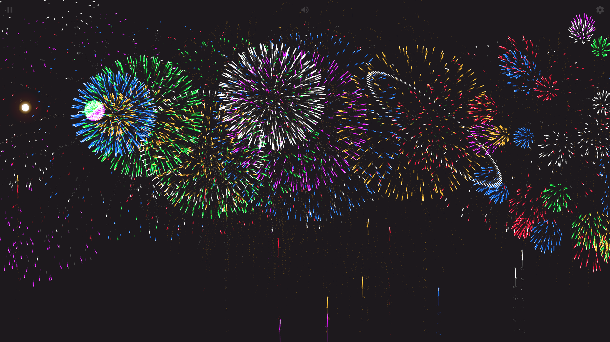

<div align="center">

# Firework Simulator

A web-based firework simulator with realistic particle physics, 12 shell types, Web Audio, and customizable backgrounds — now rebuilt with React 19 + TypeScript + Tailwind CSS.


[中文文档](./README.zh-CN.md)

</div>

## Preview

- Original demo: https://nianbroken.github.io/Firework_Simulator/
- Local dev: `pnpm dev` → http://localhost:5173



## Features

- 12 shell types (Chrysanthemum, Ghost, Strobe, Palm, Ring, Crossette, Floral, Falling Leaves, Willow, Crackle, Horse Tail, Random) with 6 auto-launch sequences (including 32-shot finale)
- Dual-canvas rendering (`mix-blend: lighten`, long-exposure) + sky lighting
- Web Audio API with randomized pitch/volume and 20 ms burst throttling
- Text fireworks via `literalLattice` + Zustand-persisted settings + custom backgrounds (image / gradient / CSS)
- Full-screen, quality auto-detect (`hardwareConcurrency`), responsive (840/560 breakpoints)
- Zero backend, static-host ready

## Tech Stack

- **React 19** + **TypeScript 6** (strict) + **Vite 8** + **Tailwind CSS 4**
- **Zustand 5** (persist + schema migration 1.1/1.2/2.0/2.1 → 1.0)
- **ESLint 9** + **Prettier** + **Vitest 4**
- Canvas 2D API + Web Audio API

## Quick Start

```bash
pnpm install
pnpm dev        # start dev server
pnpm build      # production build -> dist/
pnpm preview    # preview build
pnpm lint       # eslint
npx tsc --noEmit # type check
pnpm test       # vitest (when tests present)
```

Requires Node ≥ 20, pnpm ≥ 9.

## Project Structure

```
src/
  App.tsx / main.tsx          # bootstrap, store provider, ticker wiring
  index.css                   # Tailwind + translated 444-line style.css
  config/appConfig.ts         # frozen defaults (words, backgrounds, quality)
  types/app.ts                # QualityLevel, Selectors, HelpContent...
  stores/fireworksStore.ts    # Zustand store + normalization/migration
  lib/math.ts                 # MyMath
  lib/stage.ts                # Stage + Ticker (DPR, clamp [17,68], 500ms touch)
  lib/fscreen.ts              # fullscreen polyfill
  lib/backgroundManager.ts    # fetch vs Image, requestId dedup
  fireworks/constants.ts      # GRAVITY, COLOR, PI_2...
  fireworks/device.ts         # IS_MOBILE/DESKTOP/HEADER
  fireworks/selectors.ts      # state selectors
  fireworks/wordBurst.ts      # every-5 tracker
  fireworks/shells.ts         # 12 factories (+ quality param)
  fireworks/simulation.ts     # Shell/Star/Spark/BurstFlash pools + physics
  fireworks/audio.ts          # SoundManager factory
  fireworks/interaction.ts    # pointer/key/resize/speed bar
  fireworks/background.ts     # fallback chain
  app/ui.ts                   # 1:1 port of legacy ui.js (queryNodes/renderApp)
  components/Canvas/DualCanvas.tsx
  components/Controls.tsx/Menu.tsx/HelpModal.tsx/LoadingInit.tsx/SvgSprite.tsx
public/
  audio/  fonts/  images/  favicon.png
```

Legacy `js/` / `css/` have been removed; `public/` is the Vite static root. `legacy.index.html` was the original entry (now `index.html` → `src/main.tsx`).

## Configuration

All defaults live in `src/config/appConfig.ts`:

```ts
defaultWords: ["新年快乐", "平安喜乐", "万事顺意"]
defaultBackground: { mode: "none", value: "" } // "image" -> URL, "style" -> linear-gradient(...)
wordFontFamily: "Gabriola,华文琥珀"
qualityLevels: { low: 1, normal: 2, high: 3 }
scaleFactorOptions: [0.5, 0.62, 0.75, 0.9, 1.0, 1.5, 2.0]
```

Runtime overrides (persisted in `localStorage` key `cm_fireworks_data`):
- `src/stores/fireworksStore.ts:buildDefaultConfig` – quality auto-detect, `isDesktop ? size 3 : 2`
- Background: `src/lib/backgroundManager.ts` + `src/fireworks/background.ts` fallback `user → code default → none`

## Architecture

See [ARCHITECTURE.md](./ARCHITECTURE.md) (Chinese, detailed module graph, physics, rendering pipeline, extension points).

## Deployment

Static only. `pnpm build` emits `dist/` with relative `base: "./"` – deploy to GitHub Pages / Vercel / Nginx. HTTPS recommended for Audio/Fullscreen.

## License

`Copyright © 2022 NianBroken. All rights reserved.`

Licensed under [Apache-2.0](https://www.apache.org/licenses/LICENSE-2.0).

## Credits

- [Firework Simulator v2](https://codepen.io/MillerTime/pen/XgpNwb) by MillerTime
- [haodong108/fireworks-2023](https://gitee.com/haodong108/fireworks-2023)

Issues and PRs welcome.
